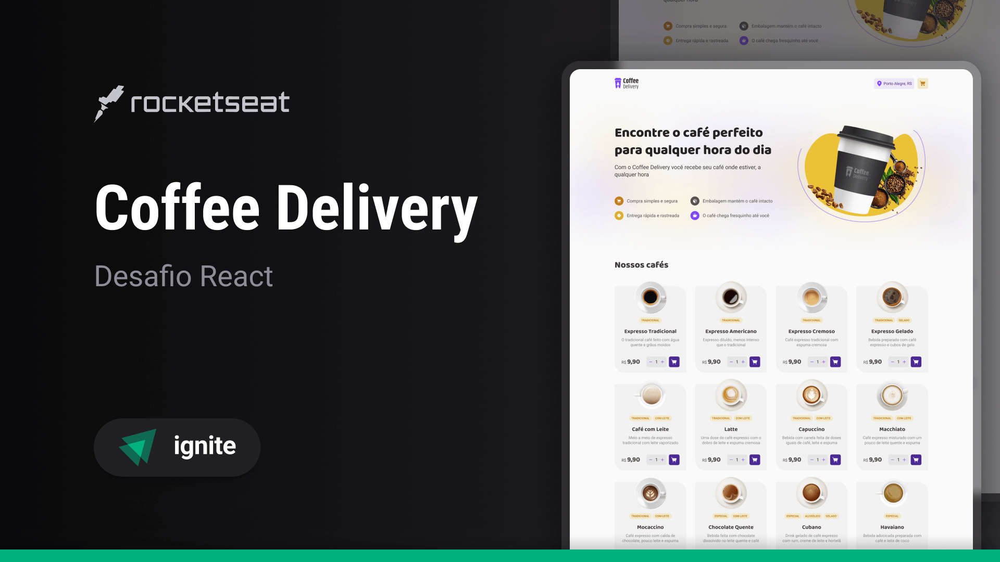

Aplicação desenvolvida como desafio da trilha Ignite da [RockeatSeat](https://rocketseat.com.br/?utm_source=aluno&utm_medium=germano-ricardi&utm_campaign=dev_fullstack).

Veja a aplicação em produção:
[https://germano-ricardi-coffee-delivery.vercel.app/](https://germano-ricardi-coffee-delivery.vercel.app/)

## Descrição  

A aplicação gerencia um carrinho de compras de uma cafeteria fictícia, que contém as seguintes funcionalidades:
*   Listagem de produtos (cafés) disponíveis para compra
*   Adicionar uma quantidade específicas de itens no carrinho
*   Aumentar ou remover a quantidade de itens no carrinho
*   Formulário para o usuário preencher o seu endereço
*   Exibir o total de itens no carrinho no Header
*   Exibir o valor total da soma de itens no carrinho multiplicados pelo valor

Apesar de serem poucas as funcionalidades, foram aplicados conceitos como:
*   Estados
*   ContextAPI
*   LocalStorage
*   Imutabilidade do estado
*   Listas e chaves no ReactJS
*   Propriedades
*   Componentização

## Tecnologias utilizadas

* [x] [NodeJS](https://nodejs.org/en/)
* [x] [React](https://reactjs.org/)
* [x] [Vite](https://vitejs.dev/)
* [x] [TypeScript](https://www.typescriptlang.org/)
* [x] [Phosphor Icons](https://phosphoricons.com/)  

## Quickstart
Clone o repositório:
```sh
$  git clone https://github.com/germanoricardi/desafios-rocketseat-coffee-delivery.git
```
Para executar a aplicação Vite:
```sh
$  npm install
$  npm run dev
```